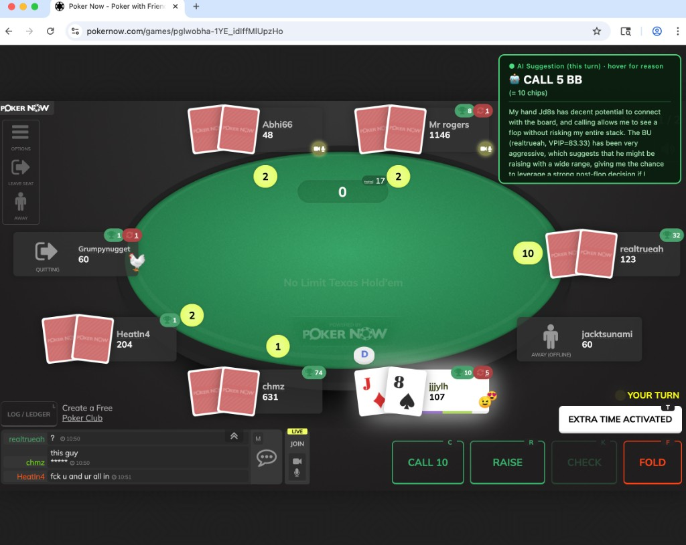

## PokerNow GPT



An LLM-powered poker assistant for [PokerNow](https://www.pokernow.club). It reads the live table (stakes, your hole cards, positions, stacks, actions, board, pot) and each opponent's VPIP/PFR from a local SQLite cache, sends that to a language model, and either shows the suggested action in an overlay (assistant mode) or clicks it for you (auto-play mode).

This is a fork of [JaimeYeung/PokerNow-AI](https://github.com/JaimeYeung/PokerNow-AI), which is itself based on [csong2022/pokernow-gpt](https://github.com/csong2022/pokernow-gpt). Changes in this fork:

- **One OpenRouter key, every model.** OpenRouter is the default provider. At startup you pick from a searchable menu of every model OpenRouter lists, with prices.
- **Any model, including the newest.** The hardcoded model allowlist (GPT-4o era, Gemini 1.x) is gone. Any model ID your provider serves works.
- **Claude support** through the official [Anthropic TypeScript SDK](https://github.com/anthropics/anthropic-sdk-typescript).
- **OpenAI-compatible endpoints** (xAI, DeepSeek, Ollama, LM Studio, ...) via a base URL.
- **Gemini moved to the current `@google/genai` SDK.** The old `@google/generative-ai` package is deprecated and its README states support ended on August 31, 2025 ([npm page](https://www.npmjs.com/package/@google/generative-ai)).
- **Reasoning effort setting** for models that support it.
- **Runs on macOS, Windows and Linux.** The macOS-only `start-chrome.sh` is replaced by a Node script that finds Chrome, Chromium or Edge.
- `npm run test-ai` checks your key and model without joining a game; `npm run list-models` shows the model IDs your keys can use.
- Dependencies upgraded (`npm audit` reports 0 vulnerabilities at the time of this change).

> **Terms of service:** automated play may violate PokerNow's rules or the rules of the game you join. Assistant mode only displays suggestions; auto-play mode clicks for you. Using either is your decision and your responsibility.

---

## Requirements

- **Node.js 22.12 or newer.** Current `puppeteer` and `openai` releases require it (check with `node -v`).
- **Google Chrome** (or Chromium / Microsoft Edge) for assistant mode.
- An [OpenRouter](https://openrouter.ai) API key with credits. (Alternatively, a direct key from Anthropic, OpenAI or Google; see "Other providers" below.)

## Install

```sh
git clone https://github.com/jason-boerst/PokerNowAI.git
cd PokerNowAI
npm install
cp .env.example .env      # Windows (cmd): copy .env.example .env
```

Open `.env` in a text editor (`open -e .env` on macOS, `notepad .env` on Windows, `nano .env` on Linux) and fill in your key:

```env
OPENROUTER_API_KEY=sk-or-...
```

That is the only required setting.

`npm install` also downloads a bundled Chrome for puppeteer (used when `use_existing_browser` is `false`). To skip that download, set `PUPPETEER_SKIP_DOWNLOAD=1` before installing.

## Choose a model

When you run `npm start` or `npm run test-ai`, a menu lists every model OpenRouter currently offers:

```
OpenRouter currently lists 312 models.
Search models (e.g. "claude", "gpt", "gemini", "free"), type "all", or a number from the list: claude
    1. anthropic/...  (in $3.00 / out $15.00 per 1M tokens, supports effort)
    2. anthropic/...  (in $1.00 / out $5.00 per 1M tokens, supports effort)
Search models ...: 1
Using model: anthropic/...
```

- Type words to search model IDs and names (every word must match), then type the number of the one you want.
- `all` lists everything; you can also type an exact model ID.
- Your choice is saved in `.last-model`, so next time you can just press Enter to reuse it.
- "supports effort" means OpenRouter reports that the model accepts a reasoning setting (see `AI_EFFORT` below).

Prices are shown as OpenRouter reports them, in US dollars per million tokens. The model count and names above are illustrative; your menu shows the live list.

### Optional settings in `.env`

| Setting | Effect |
|---|---|
| `AI_MODEL=provider/model-name` | Always use this model and skip the menu. |
| `AI_EFFORT=low` | Reasoning effort (`low`, `medium`, `high`) for models that support it, sent as OpenRouter's `reasoning: { effort }`. Unset by default, which uses the model's default. Lower effort is usually faster. |
| `AI_PLAYSTYLE=neutral` | `neutral`, `aggressive`, `passive` or `pro`. |

These override `app/configs/ai-config.json`, which you can also edit directly (`provider`, `model_name`, `playstyle`, `effort`, `request_timeout_ms`). Leave `model_name` empty there to get the menu.

`npm run list-models` prints the full OpenRouter list with prices without starting anything.

**Speed matters:** PokerNow turns are timed, and I have not measured how fast any particular model answers. `npm run test-ai` prints the latency for one sample spot; pick a model and effort that answer comfortably inside your table's turn timer.

### Other providers

You can skip OpenRouter and call a provider directly by setting `AI_PROVIDER` and its key in `.env`:

| `AI_PROVIDER` | Key variable | Notes |
|---|---|---|
| `Anthropic` | `ANTHROPIC_API_KEY` | Claude models, e.g. `claude-opus-5-5` ([model list](https://platform.claude.com/docs/en/models/overview)). Sends `effort` as `output_config.effort`, and enables server-side refusal fallbacks on Opus 5.5, Sonnet 5.5, Opus 5 and Fable 5.1. |
| `OpenAI` | `OPENAI_API_KEY` | Sends `effort` as `reasoning_effort`. |
| `Google` | `GOOGLEAI_API_KEY` | Sends `effort` as `thinkingConfig.thinkingLevel`. |
| `OpenAICompatible` | `OPENAI_COMPATIBLE_API_KEY` | Any OpenAI-style API; also set `OPENAI_COMPATIBLE_BASE_URL` (e.g. `http://localhost:11434/v1` for Ollama). |

For these, set `AI_MODEL` too (the menu is OpenRouter-only); `npm run list-models` shows the IDs each key can use.

## Check that the model works

```sh
npm run test-ai
```

This sends one sample poker spot and prints the raw answer, the parsed action, and the latency. If it prints `Parsed action: { action_str: 'bet', ... }` you are ready.

## Run

```sh
npm start
```

This opens a dedicated Chrome window (with its own profile in `~/.pokernow-gpt/chrome-profile`, so a PokerNow login persists) and starts the bot. If a debuggable Chrome is already open on the port, it is reused.

1. Pick a model from the menu (or press Enter to reuse your last one).
2. The terminal asks for the game. Paste the ID (`pgl-3YEOMYb8pdkfOtoGwyHPQ`) or the full URL. You can also pass it directly: `npm start -- https://www.pokernow.club/games/pgl-...`
3. In the Chrome window, open the game, click an empty seat, enter a name and stack, and wait for the host to approve.
4. Once seated, the bot monitors the table. On your turn a panel appears in the top-right corner. Its color is the action: **red = fold, yellow = check, green = call, bet, raise or all-in.** From top to bottom:
   - **Header:** who decided ("Preflop chart", "Engine · clear spot", "AI (model) · 70% confident", or "Engine · AI fallback"), plus the hand number, street, your seat and whether you're in position, so an old suggestion is obvious.
   - **Action banner:** what to do and how much, in big blinds, chips and share of the pot. While the AI is thinking it says "Provisional pick" with a countdown bar and shows the engine's pick; after your turn it turns grey and says "Previous turn".
   - **RNG strip:** this turn's random number from 1 to 100 and the mix it picks from, on a 1-100 bar split into the options (passive on the left, aggressive on the right) with a marker at the roll, e.g. "Check 1-62 · Bet 4 BB 63-100". In a clear spot it says "at any roll". Under it, how a balanced range plays this spot as a whole (e.g. "fold 33% · continue 67%"). See [Mixing with a random number](#mixing-with-a-random-number-rng).
   - **Bet label:** for bets and raises, "Value bet", "Semi-bluff" or "Bluff" plus lead, c-bet, barrel or stab, with a short reason.
   - **Key numbers:** equity (green when it beats the price, red when it doesn't), equity needed, pot, amount to call and SPR, in one line.
   - **Why:** always visible, the main reason in bold and up to four supporting points (measured fold rates, the EV comparison, margin notes).
   - **Warnings:** for example, the AI disagreeing with the engine, few hands on an opponent, or the game log lagging behind the table.
   - **Opponents:** one card per opponent still in the hand: seat, name, stack, type badge (nit, TAG, LAG, calling station, maniac...), "Acts after you", hands seen, estimated range. The one or two stats that matter most for this decision get a full row with a bar and a mark at your pool's average (for example "Fold to flop bet" when you could bet); the rest sit in a grid. Each stat shows its sample size and the pool average; orange with ▲ means well above the pool, blue with ▼ well below, grey means too few hands to judge. Then today's numbers, flagged changes (⚑), their last showdown and a one-line exploit.
   - **Odds:** an equity bar with a marker at the equity you need, and your equity when a bet gets called.
   - **Options:** every option with its rough EV as a bar (green positive, red negative), how often they fold or raise, its share of the mix and range of numbers, and ▶ on the suggestion.
   - **Your hand** (cards, board, what you have, draws) and **Spot** (pot, to call, stacks, SPR, legal raise sizes, position).
   - **You** (at the bottom, hidden in the compact view): your own stats, like an opponent card for yourself. Two result cards (all your hands, and today's game) with chips won or lost in big blinds and BB/100, then a table of VPIP, PFR, 3-bet, fold to 3-bet, steal, c-bet, fold to c-bet, aggression, went to showdown and won at showdown, each for all hands and today with its sample size, next to your pool's average, colored the same way as the opponents' stats. These are raw counts (exactly what you did, not blended toward the averages). It also shows how your play reads to others (the same type badge the opponents get) and what a thinking opponent would do against that. "All hands" is your earlier games plus today; "Today" fills in as the live game's hands are logged. Win rates swing a lot: even a few thousand hands are mostly luck.

   Drag the panel by its header; its position is remembered. Click a section title to collapse it (remembered), or the ▤ button for a compact view with just the action, the random number, key numbers and Why. The panel stops above PokerNow's action buttons and clicks on it never reach the table. To preview every panel state without a game: `npx tsx scripts/panel-gallery.ts <folder>` writes PNG screenshots.

**Stopping:** the bot stops by itself, printing why, when you close the game tab or Chrome, when the tab leaves the game, when you've been unseated for 60 seconds, when fewer than 2 players have been at the table for 2 minutes, or when nothing has happened for 10 minutes. The limits are in `app/configs/bot-config.json` (`stop_after_unseated_seconds`, `stop_after_short_table_minutes`, `stop_after_idle_minutes`). Ctrl+C also stops it.

**Switching models mid-game:** while the bot runs, type `m` in its terminal and press Enter. The model menu opens (bot messages are held back until you finish), and the model you pick is used from the next suggestion; you stay seated. `m provider/model-name` switches directly, and `q` in the menu cancels. The choice is also saved as your default for next time.

Manual steps: `npm run chrome` in one terminal, `npm run start:bot` in another. If Chrome is not found, set `CHROME_PATH` in `.env` to the browser executable.

### Assistant mode vs auto-play

| | Assistant mode | Auto-play mode |
|---|---|---|
| Who clicks | You | The bot |
| Browser | Your visible Chrome window | Your Chrome window, or a headless browser the bot launches if `webdriver-config.json` has `"use_existing_browser": false` |
| Config | `bot-config.json`: `"assistant_mode": true` | `bot-config.json`: `"assistant_mode": false` (the bot asks for a name and stack and requests the seat itself) |

## How decisions are made

- **Game rules:** at the start the bot reads the game's rules from the PokerNow log and your stored hands: the action clock, the 7-2 bounty, antes and straddles. It prints them as a `[Rules]` line and shows the ones that change decisions (bounty, antes) in a "Table" line on the panel. If the clock isn't in the log it assumes `decision_seconds` (15 s).
- **Preflop:** a rule-based engine answers instantly, with no AI call. It covers unopened pots, limpers, raises, 3-bets, 4-bets and more, heads-up play, and 10-handed tables. It adjusts for:
  - **Straddles:** sizes scale from the straddle, and the straddler acts last.
  - **Antes:** with enough dead money it opens and defends wider.
  - **Stack depth:** tiers at 150 and 300 BB. Deeper, it calls more with pairs and suited hands, drops weak offsuit hands, and stops stacking off KK against 4-bets. When the raise already has callers and you're not in the blinds, deep stacks add more suited hands that make sets, straights and flushes (`add_to_multiway_calls`, e.g. Q9s and 54s on the button behind a raise and two callers at 250 BB): more players can pay you off when you hit, and the price is better.
  - **The 3-bettor's measured 3-bet %:** tight, normal or loose ranges for 4-betting and calling.
  - **The 7-2 bounty:** raises 7-2 when the bounty makes it worth it.
  - **Opponents' stats:** bigger raises against callers, tighter against nits.
  - **Closing the action** (the big blind, or the heads-up small blind after a raise over your limp): call or fold by price. Against a 3-bet the charts decide, except when the 3-bet is all-in or calling leaves a stack-to-pot ratio under 2 (`three_bet_spr_below`): then a hand the chart folds calls when the price is right. When a chart folds a hand whose raw equity beats the price, the panel shows the equity the hand keeps out of position ("Equity 28% (25% kept)", colored by the kept number) and says why it's still a fold. It compares your equity against the players still in, times the share a hand like yours keeps out of position, with the equity the call needs. So a 2x open is defended much wider than a 4x open. Near break-even spots say "Close spot". The realization shares are in `price_defense` in the same file. Multiway, pairs and suited connectors keep their share while offsuit hands lose 15% of theirs (their one-pair hands are often beaten when several players continue). Deep stacks add implied odds to pairs and suited hands (up to +8% for pairs, +6% suited connectors, +4% other suited hands, and half again as much with several opponents), which can lift a hand above its raw equity; the panel then says "with implied odds" instead of "kept". These shares are assumptions, not solver output.

  - **Preflop EVs (shown, not deciding):** every preflop decision is also priced by EV: fold, check or call, a raise to the chart's size, and all-in when stacks are short. The prices come from how players in your games answer raises, measured from your stored hands, and adjusted for each player's VPIP, 3-bet and fold-to-3-bet. Folds to an open are measured by size and by blinds vs everyone else; there are separate cells for squeezes, raises over limpers, 3-bets (for the opener, for callers, and cold), and 4-bets. In the games this was built from, the size of an open barely changed how often players folded (70% to small opens, 73% to big ones, outside the blinds). Openers folded to only 23-38% of 3-bets, and limpers folded to only 9-21% of raises over their limp. The options list on the panel shows these EVs, and the reasoning says when the EV edges the chart's play by less than its margin of error.

    The EV may also replace the chart's play (`ev_pricing.overrule` in the same file), but that is off. When it was on, the simulated results got worse (6-handed at 100 BB: +115 to +72 BB/100, beyond the noise band). On your replayed hands it folded hands like AKo to a single raise and KQo from middle position. The model handles re-raises too crudely: players behind 3-bet independently, and you can only call or fold a 3-bet. Better preflop decisions need a real model of 3-bet and 4-bet play.

  The ranges and sizes are in `app/configs/preflop-ranges.json` (hand-built approximations, not solver output; every section explains its assumptions and you can edit it). Set `"preflop_engine": false` in `app/configs/bot-config.json` to use the AI preflop instead.
- **Opponent ranges:** each opponent's likely hands come from their VPIP, PFR and 3-bet %, their seat, and what they did this hand (limp, raise, limp-raise, call, 3-bet...). Calling ranges favor playable hands (pairs, suited connectors) over offsuit junk. In bounty games raising ranges include some 7-2 bluffs.
- **Flop, turn and river:** the engine estimates the rough EV of each option: fold, check, call, bets of 1/4, 1/3, 1/2, 2/3 and the full pot, a 1.5x-pot overbet on the turn or river with strong hands, and raises.
  - **When you check:** opponents behind may bet, at their measured "bets when checked to" rate.
  - **When you bet:** each opponent folds, calls with the strongest part of their range, or raises. The rates come from how players in your games actually answered the same kind of bet at a similar size on that street (a lead into the preflop raiser, a c-bet, a barrel, a stab), measured from your stored hands at every start. They're adjusted for this player's own fold and raise rates, for how this player's folds change with size, and a little on the turn and river for how weak their range is on this board. In the hands this was built from, leads into the raiser got far fewer folds and more raises than c-bets, and small bets far fewer folds than big ones (heads-up: 21% folds to bets under 30% of the pot, 39% at 45-60%, 55% at 80-105%, about 60% above).
  - **Bet size by player:** every profile counts folds to small first bets (up to 40% of the pot) and big ones (over 80%), heads-up, on any street. A player who folds more than most to big bets gets bigger bluffs; one who calls big bets about as readily as small ones gets small bluffs and big value bets. When a player clearly differs from your games' averages (33% and 60%), the panel says so under a bet.
  - **When you call (looks one street ahead):** a call on the flop or turn is valued over the next street. In each simulated hand the next card comes and the bettor bets again with a chance that follows their hand on the new card. Players in your games bet the turn 54% of the time after their flop bet was called, and the river 58% after a called turn bet (median sizes 71% and 75% of the pot); this is scaled per player by how often they bet when checked to. You keep calling only on the cards where calling that bet pays against the hands that bet, and fold on the rest. So ace high and weak pairs, which would fold to most turn bets, are worth less than their raw equity, and strong draws that keep going are worth more. An all-in call counts its full equity. The panel shows it: "If you call: they bet the turn about 55% of the time and you'd keep calling on about 30% of the cards", and what the call would look like on equity alone. In a multiway pot the next bet is priced against the bettor plus any player with a better hand who overcalls (35% each, an assumption).
  - **Implied and reverse implied odds:** the money that goes in on later streets when both hands are worth it, e.g. a set or a flush against top pair or another strong hand, from the final board's cards. It is a share of the chips still behind, capped at 1.5 pots after the flop and 0.6 pots after the turn, so deep stacks pay draws and sets more and cost one-pair hands that run into better ones. A pocket pair on a paired board counts as one pair here, not a big hand. Bets, raises, checks and calls all get the same treatment, so a call isn't favored just because it is the only option that counts later streets. Against several players the largest amount counts fully and the rest half. The shares (see `STACK_IN` in `app/engine/equity.ts`) are assumptions, not measured values.
  - **Choosing between options and sizes:** each bet or raise carries a risk: how far its EV could be off through its fold and raise estimates (one standard error of each, from the number of measured cases behind it plus a 10% model error, times what a fold or a raise changes against a call). Options are ranked by EV minus 0.75 times that risk. A bluff or semi-bluff that loses chips when called also has to beat checking (or calling or folding) by at least 0.5 BB or 5% of the pot, as before; the risk only raises that bar where the data is thin. Against several callers a bet wins chips when called from 1 / (1 + callers) equity (each chip you bet returns your equity times the number of players putting chips in), so a flush draw or top pair betting into two callers with 40% equity doesn't need that margin, though it keeps its semi-bluff label. With mixing off the panel then says "a bluff here is too close to call"; with mixing on, a bluff inside that margin mixes in less often than the passive option. Picking the highest of several noisy estimates favors the ones whose errors happen to point up, so the chosen option is overestimated on average (the "optimizer's curse", [Smith and Winkler, Management Science 52(3), 2006](https://pubsonline.informs.org/doi/10.1287/mnsc.1050.0451)). They recommend Bayesian shrinkage of each estimate; this discount is a simpler stand-in that does the same job roughly. In practice a pot-size flop c-bet, measured on 17 heads-up cases in your games, has to beat a half-pot or two-thirds-pot c-bet, measured on 497, by a clear amount. When the pick isn't the top EV, the panel says why.
  - **Every bet is labeled** under the action: **Value bet** (green), **Semi-bluff** (amber) or **Bluff** (red), plus what kind of bet it is (lead into the preflop raiser, c-bet, barrel, stab). The lines below give the folds a bluff needs vs the folds expected, how often you'll get raised, and how players in your games answered that kind and size of bet, with the number of cases.
  - **Reading bets:** what a bet or raise means on each street is learned from the showdowns in your stored hands, with two corrections fit on your hands at every start:
    - **Bluffs that never show:** a flop or turn bettor who gives up later never shows, so the hands shown after flop and turn bets lean stronger than what bettors hold, and the engine used to fold too often against bets. River bets that get called are a fair sample (the bettor must show), so the engine rebuilds each such bettor's range the way it reads ranges and finds, by maximum likelihood, how much to scale the flop and turn bet and raise weights of hands with nothing and draws so its reading matches what they showed (pulled toward no change while the sample is small). On the 332 called river bettors in the games this was built from, they showed 22.6% air where the uncorrected reading expected about 16%.
    - **7-2 under the bounty:** in your games a shown 7-2 with no pair bet 86% of the time when checked to or first to act, against 28% for other hands with nothing (it wins a bounty when it wins the pot). So under the bounty the engine reads 7-2 as betting and raising like a strong hand, while it still wins or loses by its real strength. This explained the called river bettors far better (log-likelihood -326.6 without it, -275.5 with it, each with its fitted bluff correction), and with it the remaining correction is small (about x1.4).

    - **7-2 sizing tells:** at every start the bot checks whether players in your games size their raises or bets differently with 7-2: opens, raises over limpers, 3-bets, and the preflop raiser's flop and turn bets, each against the same player's usual size (their median, or your games' median for players with under 5 cases; "big" is 1.25x it preflop, 1.3x for bets). A tell turns on only if shown 7-2 was big clearly more often than every other hand (z of at least 3, about p < 0.0013 each, under 0.01 for the five together, and at least 10 shown 7-2). Then, after a big one, the odds of 7-2 in that player's range are multiplied by the measured ratio (pulled toward 1 for sample size), and by a smaller one for a normal size, and the opponent card shows a "Possible 7-2" flag. In the games this was built from only the open size passed: 7-2 opens were big 29% of the time against 12% for every other open (79 shown 7-2 opens by 46 players; z 4.5; still 50% vs 13% among hands shown only at showdown, so it isn't that big opens win more and get shown more; no single player drives it). Even so, a big open was a known 7-2 only about 7% of the time (2.5% for a normal open), so it raises the odds of 7-2 about two to three times; it doesn't identify it. Raises over limpers (6 of 13 big), 3-bets, and flop and turn bets showed no significant tell (flop bets on boards without a 7 or 2: 15% vs 9%, z 1.8). With more stored hands these are retested at every start.

    The bot prints both at start ("Bluff check on N called river bets...", and one "7-2 tell" line per candidate) and `npm run evaluate` reports them in part 0. On the replayed spots where the opponent's cards were shown later, the corrections cut the spots where the engine folds and you continued from 14 to 13 and moved engine minus you from +69 to +102 BB (+204 to +230 by equity); that sample is small and leans toward calls, so it's a check, not proof.

  Later streets are covered only roughly (the next street for a call, implied odds for the rest), so treat the numbers as a guide.
  - **Clear spots** (the best option is ahead by at least 1 BB or 15% of the pot, or the only question is bet size): the engine answers instantly.
  - **Mixed spots** (options close enough to mix, see below): the random number picks, instantly, without the AI.
  - **Close spots:** the AI gets the full hand history, the engine's numbers, opponent profiles, your pool's averages and the table notes, and must reply in JSON within its time budget. Its answer is checked for legality; if it's illegal, unreadable or late, the engine's best option is used.
  - **AI time budget:** `llm_timeout_ms` (default 6 s), and never more than the game's clock minus 7 s for you to read and click. With a 15 s clock the AI gets 6 s; with 10 s it gets 3 s; under that it is skipped. The panel shows the engine's pick while the AI thinks.
  - **`ai_mode`** in `bot-config.json`: `"auto"` (default), `"close_spots"`, `"off"` (engine only, instant), or `"always"` (the AI is also asked in mixed spots and told the roll and the mix; the panel warns when it goes against the roll).
  - **`"auto"`** acts like `"close_spots"` until your recorded decisions say the AI loses to the engine. Each post-flop suggestion now stores the engine's top option, its EV and the EV of the option picked; at start the bot fills these in once for older decisions (re-analyzed with today's profiles) and checks: with 200+ AI decisions measured, if the AI gives up EV by the engine's numbers (95% interval above 0) and your results following it in close spots are not clearly better than following the engine in close spots, it turns the AI off and prints `[AI check] ...`. The EV measure favors the engine by construction (the engine judges itself), so the result comparison is the AI's only way to show an edge, and a few hundred hands rarely show one; set `"close_spots"` to keep the AI on regardless. `npm run evaluate` part 4 prints the same check.
  - The terminal prints `[Engine]` (equity and EV per option), `[RNG]` (the roll and the mix) and `[Decision]` (who decided and why).

### Mixing with a random number (RNG)

Every suggestion comes with a random number from 1 to 100. In a clear spot it doesn't matter: the same play at any roll. In a close spot the options are split over 1-100 and the roll picks one, so you don't always play the same hand the same way. Low numbers are the passive options and high numbers the aggressive ones, the way solver trainers do it (GTO Wizard's "high RNG" mode: a check on 1, an overbet on 100; [GTO Wizard help](https://help.gtowizard.com/how-to-use-the-trainer/)). For example "Fold 1-24 · Call 25-80 · Raise 81-100" with a roll of 91 says raise.

How the frequencies are set:

1. **Only close options mix.** At equilibrium a hand mixes only between actions with the same EV. The engine's EVs are estimates, so options within 0.5 BB or 5% of the pot of the best one count as equal and mix; anything further behind is never picked. When the exploit is clear it is played every time.
2. **Balanced-range (GTO) starting weights** decide the split, from your own range on this board as other players can estimate it (from your stats and this hand's actions):
   - **Facing a bet:** a balanced defense continues with the minimum defense frequency of its range, pot / (pot + bet), shared between the players facing the bet, and scaled down by the share of equity hands keep before the river (the engine's realization: about 80-85% out of position on the flop, 100% on the river). Solvers defend close to MDF in position and on the river and clearly less out of position on earlier streets. Hands ranked inside that share of your range continue, hands below it fold, hands near the line mix.
   - **Betting:** value hands (top pair or better) bet (a balanced range checks about 15% of them, so its checks aren't all weak). Bluffs bet as often as the balanced ratio of bluffs to value allows: bet / (pot + bet) bluffs per value bet (1 per 2 for a pot-size bet, 1 per 3 for half the pot), draws first, then hands with nothing. That is the river's ratio; before the river a balanced range bluffs more because its bluffs have equity, but the engine's EVs already count that equity, so these weights stay on the careful side. A medium pair is never turned into a bluff.
   - **Preflop:** hands at the edge of a chart range mix with the neighboring action, as solver charts do: the weakest hands in the 3-bet range sometimes just call, the strongest calls sometimes 3-bet, the last hands in an opening range sometimes fold and the first ones outside it sometimes open. The range's overall frequency stays the same. Calls priced by equity (closing the action) mix with folding when the call is worth within the margin of folding.
3. **The weights lean toward the better EV**, which keeps the exploit in the mix. A bet's EV counts its risk less (how far it could be off through its fold estimate, see "Choosing between options and sizes"), so a bluff that is only barely ahead mixes in rarely instead of being played every time.
4. **Balance only pays against players who notice.** Against regulars (TAG, LAG, regular) the full band applies; against unknown players 75% of it; against calling stations, loose-passive players and maniacs (35%) and nits (50%) only near-ties mix, because exploiting them is worth more than balancing. That follows common advice: GTO as the default against unknown players and strong regulars, exploits against weaker players who don't adjust ([PokerCoaching](https://pokercoaching.com/blog/gto-vs-exploitative-poker/), [Pokerology](https://www.pokerology.com/poker/strategy/gto-vs-exploitative/)).

Options mixed less than 5% of the time are dropped. The roll comes from the operating system's secure random generator, one per turn, and is saved with the decision.

**`rng_mixing`** in `bot-config.json`:

| Setting | What mixes | Cost on your stored hands (engine's own estimate) |
|---|---|---|
| `"balanced"` (default) | options within 0.5 BB or 5% of the pot, narrowed against players who don't adjust | about 4.7 BB per 100 hands |
| `"exploit"` | only near-ties (0.25 BB or 2.5% of the pot) | about 0.6 BB per 100 hands |
| `"gto"` | options within 1 BB or 10% of the pot, against everyone | about 27 BB per 100 hands |
| `"off"` | nothing: always the engine's single best option (the random number isn't shown) | 0 |

The cost is the EV given up by not always taking the engine's best option, by the engine's own numbers (bets counted at their risk-adjusted value), measured by `npm run evaluate` over your replayed decisions. The benefit, being harder to read for players who study you, can't be measured from these hands. On your hands the balanced mix bluffed less than the engine alone (about 19% of post-flop decisions instead of 22%) and moved its betting toward the balanced rate of each spot (betting when checked to: engine 56%, balanced mix 53%, gto mix 46%, a balanced range 39%); against bets the engine continues 49% of the time, about the balanced defense (49%), and the mixes slightly more (balanced 51%, gto 54%). The gap between the engine and the balanced range is the exploit: your games fold to bets more than a balanced opponent would.

Sources for the formulas: minimum defense frequency and alpha ([GTO Wizard](https://blog.gtowizard.com/mdf-alpha/)), the balanced bluff-to-value ratio by bet size ([Upswing Poker](https://upswingpoker.com/what-is-bluff-to-value-ratio/)), mixing only between equal-EV actions ([GTO Wizard](https://blog.gtowizard.com/the-three-laws-of-indifference/)), and where MDF falls short (solvers often defend less than MDF out of position and before the river: [GTO Wizard](https://blog.gtowizard.com/mathematical-misconceptions-in-poker/)). These are approximations built on those principles, not solver output.

## Measuring how well it plays

Every decision and every finished hand is recorded in `app/pokernow-gpt.db` while the bot runs.

| Command | What it does |
|---|---|
| `npm run stats` | Your results in bb/100 with a 95% confidence interval, overall and per model, plus a Suggestions table: how often you followed each source's advice and your results when you did vs didn't. Poker is noisy: expect "can't tell yet" for a long time (tens of thousands of hands). |
| `npm run label` | Shows recorded spots (cards, full action history, pot, odds) and lets you enter the correct play. |
| `npm run eval -- --models a/x,b/y` | Replays recorded spots through each model: % legal actions, agreement with your labels, latency. Costs API credits; asks first. |
| `npm run players` | Opponent profiles from all recorded and imported hands: type (calling station, nit, maniac, loose-passive, TAG, LAG), key stats with sample sizes, and the main exploit. `npm run players -- <name or id>` adds game-by-game history and recent showdowns. See [Player database](#player-database-import-past-games). |
| `npm run export-hands` | Writes hands and decisions to `hand-export.json` with player names anonymized. |
| `npm run evaluate -- app/pokernow-gpt.db` | Judges the engine (AI off) on your stored hands, about 5 minutes. (0) How opponents' bets are read: the bluff correction fit on called river bettors, and the 7-2 sizing tells. (1) Spots where the opponent's cards were shown later: what the engine's fold or continue choice would have won vs yours, with 95% intervals. (2) Your results in hands where you did what the engine suggests vs where you didn't (correlational only). (3) A simulated match against a pool built from your players' stats: this only shows the engine beats its own model of the pool, not real results. (4) The AI against the engine in close spots, from the suggestions recorded while the bot ran (see `"auto"` under `ai_mode`). Also: how often each mixing style mixes, what it costs, and how it moves bluffing, betting and defending compared with the balanced rates. Each game is judged with profiles built from the other games only. `--no-sim` skips part 3. |
| `npm run leaks -- app/pokernow-gpt.db` | Where you lose money, from your own hands: your results by preflop line and seat (open, call a raise, 3-bet, limp...) and by what you did after the flop (c-bet or check as the raiser, call or raise facing a bet), all-in adjusted with 95% intervals; your stats against the average other player in your games (VPIP and PFR by seat, 3-bet, fold to 3-bet, steals, c-bet, folds to bets by street, showdown rates); river calls (how often they won vs what the price needed, counted from the pot so mucked hands count) and river bluffs (how often they got folds vs what the size needed); and the spots where you went against the engine. A line is flagged as a finding only when it has 20+ hands and is far enough out that, across all the lines tested, the chance of any false finding stays near 5% (Bonferroni). Results by line are correlational (the cards decide most of them), and a stat that differs from your games' average isn't wrong by itself. `--fast` skips the engine replay (seconds instead of minutes); `--all` lists lines with few hands; `--out file.json` saves it. The same report without the engine comparison is the dashboard's **Your leaks** tab. |
| `npm run benchmark -- <copy of the db> --out reports/x.json [--compare reports/old.json]` | The numbers every engine change is checked against, in one JSON with fixed seeds: engine minus you on shown-down spots by street, agreement with you, the bluff fit and 7-2 tells, how well the response table predicts folds on held-out games, decision timing, the scenario suite and the simulator against its control. `--compare` prints each change with its noise band. `reports/` is not committed. |
| `npm run scenarios -- app/pokernow-gpt.db` | Runs 132 hand situations (preflop at every position, heads-up, straddles, antes, short stacks, 3-bets to 5-bets, value, draws, bluff-catching, multiway, all-ins) through the engine with your measured pool numbers and checks each result (legal, never folds when checking is free or with the nuts, value bets stations, folds air to nits' big river bets, labels match equity). Without the database it uses the built-in defaults. |

While playing, each turn prints a `[State]` line (position, street, pot, amount to call, pot odds, min raise, effective stack, SPR). If it doesn't match the table, please report it.

Each turn also prints an `[Engine]` line: your equity (share of the pot you'd win on average) against each remaining opponent's estimated range, and the equity you need to call. Ranges come from each player's VPIP/PFR (population defaults until a player has 20 hands) and their actions this hand. They are estimates built on stated assumptions, not solver output.

## Player database: import past games

Every hand is stored in `app/pokernow-gpt.db` on your computer, keyed by PokerNow's player id (names change between games, ids don't). Past games come from PokerNow's log download, and live games are added as you play. Opponent stats from both feed every decision.

### Import logs

In a PokerNow game, open the **Log** and download it. The file is named `poker_now_log_<game id>.csv`. Then either:

- **Dashboard:** `npm run dashboard`, open http://localhost:4545, and drag the files onto the page (or click **Import logs**).
- **Terminal:** `npm run import -- ~/Downloads/poker_now_log_pglAbC.csv` (several files or a whole folder also work).
- **Folder:** put the files in a `logs/` folder in this project. `npm start` imports anything new in it each time it starts, and `npm run import` with no arguments does the same.

Importing the same file twice is safe: hands already stored are skipped. What's imported and how:

- **Complete hands only.** A hand in progress when you downloaded, or cut off at the start of the file, is skipped and counted.
- **PokerNow's download seems to keep only the newest 20,000 log lines** (roughly 600 to 850 hands in the logs tested). One of the test logs had exactly 20,000 lines and started at hand #120. The import results say when a file starts after hand #1. For long games, download the log partway through and again at the end: the imports merge without duplicates. Games you play with the bot running are recorded hand by hand, so the limit doesn't apply to them.
- **Which player is you:** found from the hole cards in the log ("Your hand is ..."), matched to your showdowns or to the seat that was dealt in exactly when you were. A log downloaded while you weren't playing has no hole cards, so it can't tell. Your ids are grouped under "YOU", so your own play gets its own profile.
- **Same person, different id:** PokerNow's "changed the ID" messages link ids automatically. Otherwise link them yourself on a player's page in the dashboard ("Same person") or with `npm run players -- link <id or name> <id or name>`. Undo with "Split out" or `npm run players -- unlink <id>`. Ids are never merged by name, because different people use the same name.
- **Game types:** Omaha hands and bomb pots count toward results (BB/100, net) but not toward the tendency stats, which are Hold'em only. 7-2 bounty payments count toward results.

### Dashboard

`npm start` opens it for you in the background and prints `Player stats: http://localhost:4545`: open that link in your browser. Without the bot, run `npm run dashboard`. It's only reachable from your own computer; set `DASHBOARD_PORT` in `.env` to change the port, or `DASHBOARD_PORT=0` to turn it off. It shows:

- **Now:** the game you're playing, refreshed every 15 seconds: how each player is playing today next to their usual numbers, with clear changes flagged.
- **Your games on average:** the typical opponent in your games (these averages are also what the bot assumes for players with little history).
- **Your leaks:** where you lose money, from your stored hands: results by line, your stats against your games' average player, and the river checks, with the lines that pass the bar for a finding listed first. See `npm run leaks` above for what each line means; that command also adds the spots where you went against the engine.
- **Results:** for each suggestion source (preflop chart, post-flop engine, AI), how often you followed it and your results when you did vs when you didn't, luck-adjusted, with 95% ranges. It needs many hands before it says anything firm.

- **Players:** every opponent with hands, games, VPIP, PFR, 3-bet, limp, fold to 3-bet, c-bet, fold to c-bet, aggression, WTSD (went to showdown), W$SD (won at showdown), BB/100 and net result; "More stats" adds steals, folds to a bet on each street, raises vs a bet and bets when checked to. Search, set a minimum number of hands, and click a column to sort. Each percentage shows its sample size.
- **A player's page:** all their stats with raw counts, VPIP by position, average bet size, how their most recent game differed from their usual play, a game-by-game table, the cards they've shown with the line they played, and their ids.
- **Games:** every game, and for one game, how each player played in it next to their usual numbers from every other game, with clear changes flagged. Tick "Refresh every 15 seconds" on the game you're playing to watch it live while the bot records hands.


### How the history is used at the table

- **Long-term:** a player's hands from every other game. **This session:** their hands from the game you're playing now (including any you imported from it earlier).
- The stats the engine uses are this session's numbers blended toward the player's own long-term numbers (their history counts as 30 chances of evidence), so a player who is clearly playing differently today moves the estimate, and a few odd hands don't.
- Players with little or no history are assumed to play like the average opponent in your stored games (not you). These averages are recomputed every time the bot starts, so they track your player pool as you import and record more hands; the built-in guesses only matter while the database is small (they count as 200 chances). The terminal prints the averages at startup.
- A change is flagged when a stat has at least 15 chances this session and differs from their usual number by more than 10 points and about two standard errors. Checked stats: VPIP, PFR, aggression, 3-bet, fold to c-bet and going to showdown.
- These estimates set the opponent ranges and fold and aggression rates in the equity and EV numbers, the preflop adjustments, and the opponent section of the AI prompt (which lists long-term and session numbers and any flagged changes). The overlay shows each opponent's history as "N before + M today hands", their usual VPIP/PFR next to today's, and a ⚑ line for each flagged change.
- Hundreds of hands are needed before most stats settle: a 20% stat measured over 100 chances has a standard error of about 4 points. The sample size is shown next to every number so you can judge.

The database and logs stay on your computer: `*.db` and `logs/` are in `.gitignore`.

## Troubleshooting

- **The bot stops or seems stuck after opening the game:** with the game open in the bot's Chrome window, run `npm run diagnose` in a second terminal. It lists which table elements the bot can see (element counts and the blinds text only, no names or cards). If items marked "expected always" are missing while the table is visible, PokerNow has changed its page layout and the bot's selectors need updating.
- **"Failed to pull logs: ..."** the message after the colon says why (HTTP status, not JSON, no hand start found). The game log is fetched from inside the game tab, so the game must stay open in the bot's Chrome window. `npm run diagnose` also checks the log and prints its newest entries with player names hidden.
- **"Could not read the blinds from the page":** the bot shows the text it found and asks you to type the blinds (e.g. `10/20`). Please report that text so the parser can be fixed.

## Development

```sh
npm run typecheck   # tsc --noEmit
npm test            # offline unit tests
npm run test:live   # upstream tests that hit live PokerNow game logs (the game IDs in them may have expired)
```

## License

MIT. See `LICENSE`.
